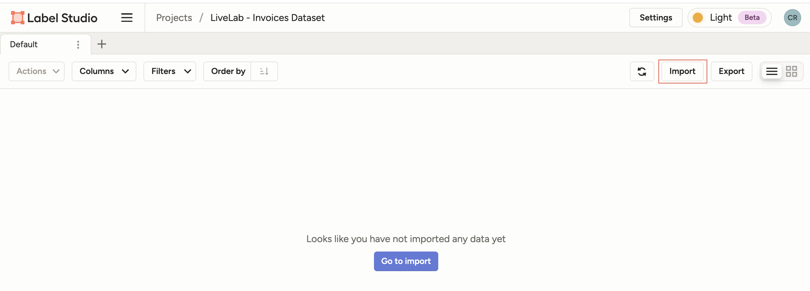
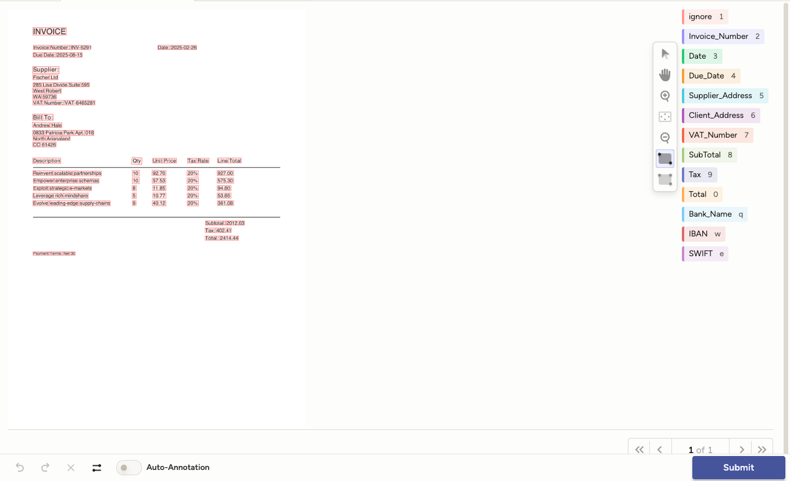
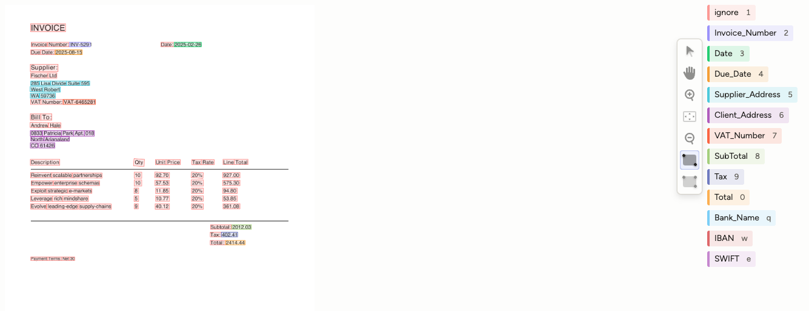

# Labelling your dataset

## Introduction

In this session we will import the data into Label Studio and start labelling it.

***Estimated Lab Time*** 60 minutes

### Objectives:

In this lab, you will:
* Import the tasks for annotation and start labelling

### Prerequisites

This lab assumes you have:
* All previous labs successfully completed.
* Basic scripting skills in Python and Bash

## Task 1: Import the Data for annotation

1. 
Import the generated tasks.json file for fresh annotation by clicking import inside the project:

2. Upload the only JSON file to import.

Once imported, the bar should look green as below, and then click on the "Import" button on the top right.

You should see the project folder full of tasks like in the following image:

## Task 2: Create the annotations
Reference : https://labelstud.io/guide/setup
Open the labelling interface, you will notice the automatic text recognition has been done by the OCI backend OCR (Optical Character Recognition). Label the text by matching it to the labels you defined earlier seen on the right hand side of the page.

When opening one task, you will see the following tagging interface after loading and producing the OCR using the OCI backend OCR:

Each rectangle will be assigned, by default, to the label "ignore". When you click at one rectangle (bounding box) you can then select which is the label for that rectangle, as in the following steps:
_**Tip:** You can use ctrl (or command for Mac) to select multiple rectagles and tag them at the same time._

This is an example of a fully tagged document:

## Acknowledgements
* **Authors** 
    - Cristina Granes, AI Cloud Services Black Belt
    - David Attia, AI Cloud Services Black Belt
* **Last Updated By/Date** 
    - Cristina Granes - AI Cloud Services Black Belt, August 2025
