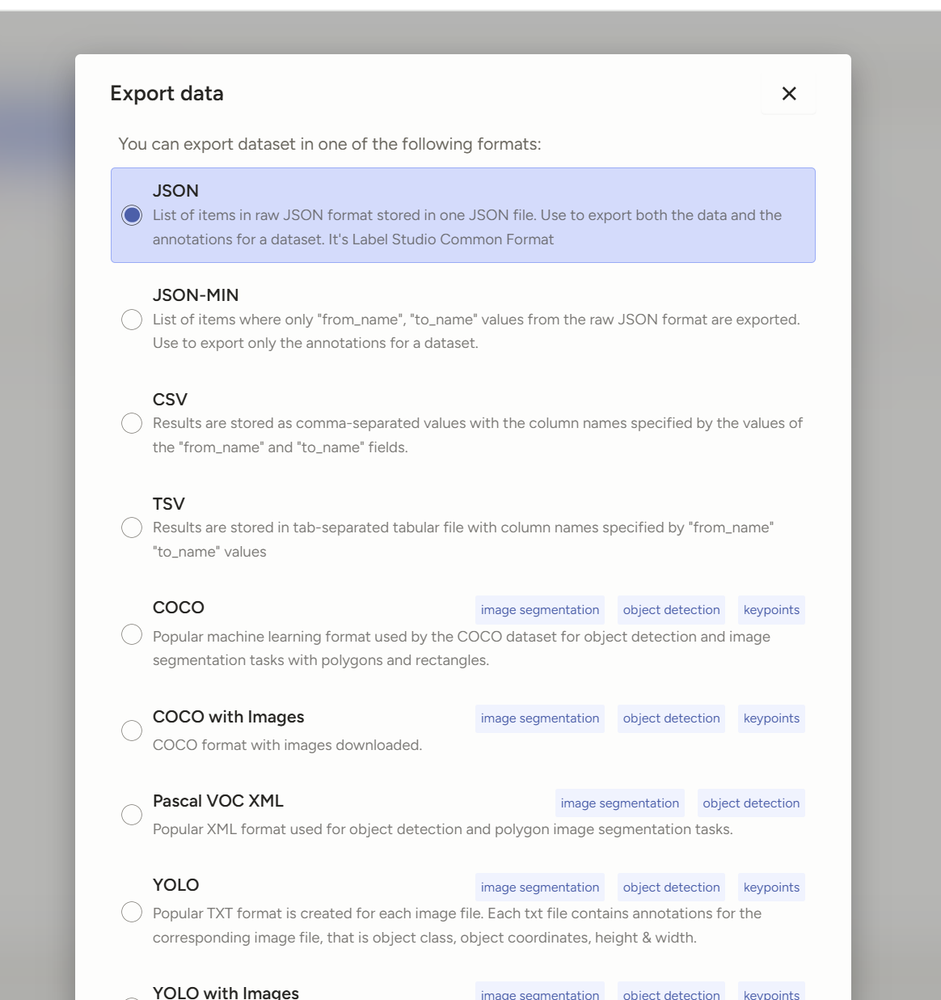

# Setup and install Label Studio

## Introduction

This Lab will guide you through the process of setting up and runinng Label Studio on your machine.

***Estimated Lab Time*** 20 minutes


### Objectives:

In this lab, you will:
* Export the JSON from Label Studio and generate the manifest script

### Prerequisites (Optional)

This lab assumes you have:
* All previous labs successfully completed.
* Basic scripting skills in Python and Bash

## Task 1: Generate manifest file for Custom Key-Value extraction model

1. Export Annotations 

    - Click on the export button 
        

    - Export the labels into JSON-MIN format as shown below
        


2. 
  Generate Manifest file
  
    - Paste the following code into a new .py file on your local machine. Reassign the variables towards the end (## test example) to match your data (paths and buckets)
    
            ```
        import json
        
        def generate_manifest(
            labels: list,
            dataset_bucket: str,
            dataset_namespace: str,
            record_bucket: str,
            record_namespace: str,
            record_path: str,
            output_path: str = "manifest.jsonl",
            prefix: str = ""
        ):
            """
            Generate a .jsonl file with a specified structure.
            
            Parameters:
            - labels: list of label names (e.g., ["Invoice_date", "Invoice_Number"])
            - dataset_bucket: bucket name for dataset source
            - dataset_namespace: namespace for dataset source
            - record_bucket: bucket name for record file
            - record_namespace: namespace for record file
            - record_path: path to record file (e.g., "records_image_ls.json")
            - output_path: path to save .jsonl file
            """
            json_obj = {
                "id": "dummy",
                "compartmentId": "dummy",
                "displayName": "training_data",
                "labelsSet": [{"name": label} for label in labels],
                "annotationFormat": "KEY_VALUE",
                "datasetSourceDetails": {
                    "namespace": dataset_namespace,
                    "bucket": dataset_bucket,
                    "prefix": prefix
                },
                "datasetFormatDetails": {
                    "formatType": "DOCUMENT"
                },
                "recordFiles": [
                    {
                        "namespace": record_namespace,
                        "bucket": record_bucket,
                        "path": record_path
                    }
                ]
            }
        
            with open(output_path, "w") as f:
                f.write(json.dumps(json_obj) + "\n")
        
            print(f"JSONL file written to {output_path}")
        
        
        ## Test Example
        labels = ["Invoice_date", "Invoice_Number"] # Be careful, it's case sensitive
        generate_manifest(
            labels=labels,
            dataset_bucket="raushan_bucket",
            dataset_namespace="axylfvgphoea",
            record_bucket="raushan_bucket",
            record_namespace="axylfvgphoea",
            record_path="test_ls_integration/records_converted_kv.json",
            output_path="manifest.jsonl", # extension should be .jsonl 
            prefix="test_ls_integration/" #prefix always ends with /
        )

        ```
  
3.
Upload your manifest file, record file and image/pdf documents in the bucket and path defined in the manifest. 


## Task 2: Generate manifest file for Custom Document Classification model

1. 
Export Annotations 

    - Click on the export button 
    

    - Export the labels into JSON format as shown below
    

3. 
    Generate manifest file
    - Paste the following code into a new .py file on your local machine. 

        ```
        import json
        
        def generate_manifest(
            labels: list,
            dataset_bucket: str,
            dataset_namespace: str,
            record_bucket: str,
            record_namespace: str,
            record_path: str,
            output_path: str = "manifest.jsonl",
            prefix: str = ""
        ):
            """
            Generate a .jsonl file with a specified structure.
            
            Parameters:
            - labels: list of label names (e.g., ["Invoice_date", "Invoice_Number"])
            - dataset_bucket: bucket name for dataset source
            - dataset_namespace: namespace for dataset source
            - record_bucket: bucket name for record file
            - record_namespace: namespace for record file
            - record_path: path to record file (e.g., "records_image_ls.json")
            - output_path: path to save .jsonl file
            """
            json_obj = {
                "id": "dummy",
                "compartmentId": "dummy",
                "displayName": "training_data",
                "labelsSet": [{"name": label} for label in labels],
                "annotationFormat": "KEY_VALUE",
                "datasetSourceDetails": {
                    "namespace": dataset_namespace,
                    "bucket": dataset_bucket,
                    "prefix": prefix
                },
                "datasetFormatDetails": {
                    "formatType": "DOCUMENT"
                },
                "recordFiles": [
                    {
                        "namespace": record_namespace,
                        "bucket": record_bucket,
                        "path": record_path
                    }
                ]
            }
        
            with open(output_path, "w") as f:
                f.write(json.dumps(json_obj) + "\n")
        
            print(f"JSONL file written to {output_path}")
        
        
        ## Test Example
        labels = ["Invoice_date", "Invoice_Number"] # Be careful, it's case sensitive
        generate_manifest(
            labels=labels,
            dataset_bucket="raushan_bucket",
            dataset_namespace="axylfvgphoea",
            record_bucket="raushan_bucket",
            record_namespace="axylfvgphoea",
            record_path="test_ls_integration/records_converted_kv.json",
            output_path="manifest.jsonl", # extension should be .jsonl 
            prefix="test_ls_integration/" #prefix always ends with /
        )

        ```  


## Acknowledgements
* **Authors** 
    - Cristina Granés, AI cloud services Black Belt
    - David Attia, AI cloud services Black Belt
* **Last Updated Date** - <08/2025>
